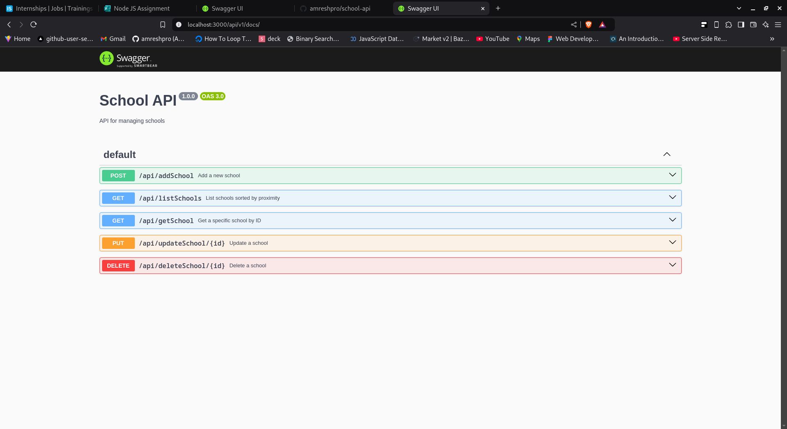
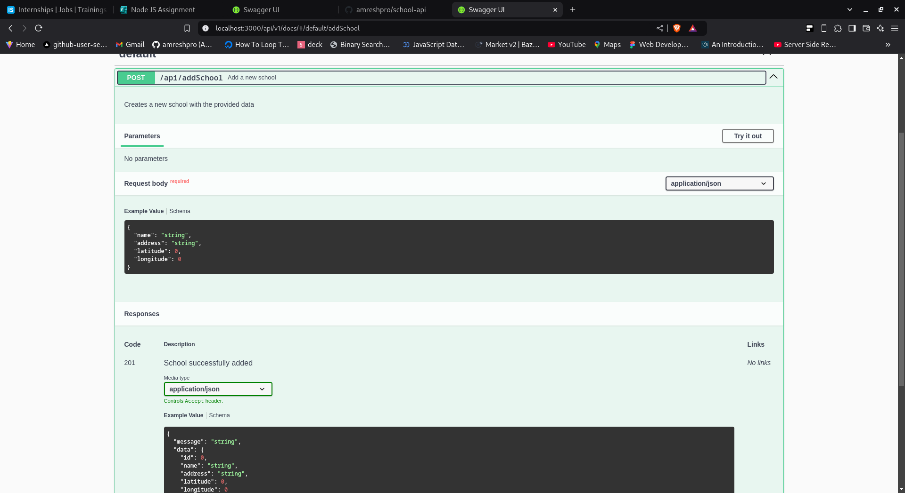

# School API

## Installation

### Step 1
`git clone https://github.com/amreshpro/school-api `
### Step 2
`cd school-api`
### Step 3
`bun install`

> Provide ENV Variables
### Step 4
`bun run build; bun run start`
or
`bun run dev`

